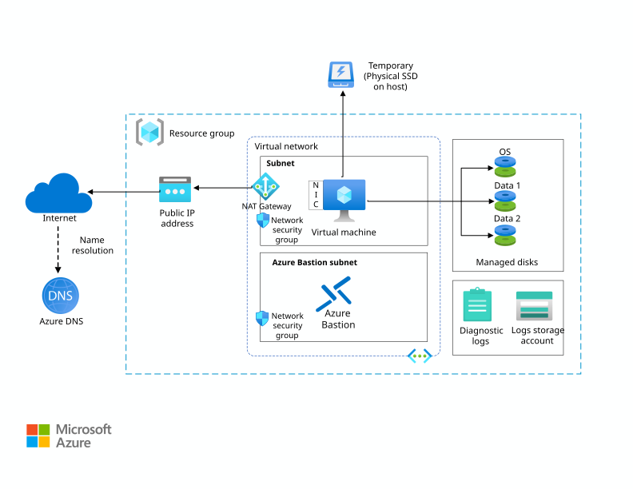

# Azure Architectures recreated with Terraform

I recreate Azure architectures using Infrastructure as Code (IaC) to practice designing and building for the cloud.

This README provides a brief description of each architecture, along with the lessons learned while building it. The corresponding Terraform code can be found in the respective directories.

## Run a Linux VM on Azure

### Architecture Description

The Linux VM has no public IP address and can only be accessed via Azure Bastion. The bastion host is attached to a public IP address and can be used as a jump box to SSH into the VM. The NAT Gateway allows the VM to connect outbound to the internet while remaining in a fully private subnet. 

### Lessons Learned

- Azure Bastion subnet must be `/26` or larger and it's name must be exactly **AzureBastionSubnet**
- No NSG is required for the AzureBastionSubnet, because it's a managed service and you have to use the Azure portal to use it
- When using a Linux VM (IaaS) as a jump host, a NSG needs to allow SSH traffic
- Azure Bastion service is more expensive than a Linux VM jump host