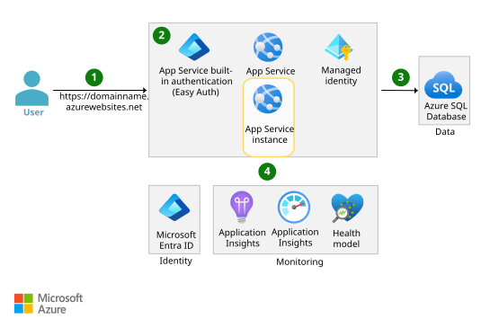

# Azure Architectures recreated with Terraform

I recreate Azure architectures using Infrastructure as Code (IaC) to practice designing and building for the cloud.

This README provides a brief description of each architecture, along with the lessons learned while building it. The corresponding Terraform code can be found in the respective directories.

## Run a Linux VM on Azure

### Architecture Description

The Linux VM has no public IP address and can only be accessed via Azure Bastion. The bastion host is attached to a public IP address and can be used as a jump box to SSH into the VM. The NAT Gateway allows the VM to connect outbound to the internet while remaining in a fully private subnet. 

### Lessons Learned

- Azure Bastion subnet must be `/26` or larger and it's name must be exactly **AzureBastionSubnet**
- No NSG is required for the AzureBastionSubnet, because it's a managed service and you have to use the Azure portal to use it
- When using a Linux VM (IaaS) as a jump host, a NSG needs to allow SSH traffic
- Azure Bastion service is more expensive than a Linux VM jump host

## Basic web application

### Architecture Description

A Python FastAPI backend is hosted on an Azure App Service managed instance. The backend connects to an Azure SQL Database instance (PaaS) to persist data. The authentication between the App Service and the database is done secretless through a managed identity managed by Azure. Entra ID Easy Auth provides authentication for the app. Several additional services are deployed for monitoring the application.

### Architecture Edits

While building this, I made a few architectural changes worth noting. I switched to a consumption-based Container App Environment workload profile. This option is cheaper than running the app on an App Service instance, because App Services have a fixed monthly cost based on the chosen SKU. I also haven't implemented Easy Auth yet. Instead of a managed identity the Container App currently connects to the database using a connection string. I implemented a Private Endpoint so the database can be reached from the Container App Environment over the Azure backbone. For security reasons I disabled public internet access to the database entirely.

### Lessons Learned

- It's cheaper to deploy a Docker image as a Container App, because unlike App Services, the billing is consumption-based
- If you don't use a CI/CD pipeline to deploy the infrastructure, you have to manually to push the image to the Azure Container Registry before creating the Container App
- Although I hold a CCNA certification, Azure Cloud Networking is still confusing to me, especially DNS Zones and Private Endpoints
- The [Container App Environment's default Workload profile is Consumption](https://learn.microsoft.com/en-us/azure/container-apps/custom-virtual-networks?tabs=workload-profiles-env#subnet). The minimum subnet size required for virtual network integration is /27. You must delegate the subnet to Microsoft.App/environments.
- I just realized the state file stores some passwords in plain text. Definitely a security concern worth addressing. Using a Managed Identity would remove the need for database credentials altogether. Access to the tfstate Blob Container needs to be locked down via RBAC.

## Useful Resources

- The **Cloud Adoption Framework** provides [official naming convention advice](https://learn.microsoft.com/en-us/azure/cloud-adoption-framework/ready/azure-best-practices/resource-naming)
- [Abbreviation recommendations for Azure resources](https://learn.microsoft.com/en-us/azure/cloud-adoption-framework/ready/azure-best-practices/resource-abbreviations)